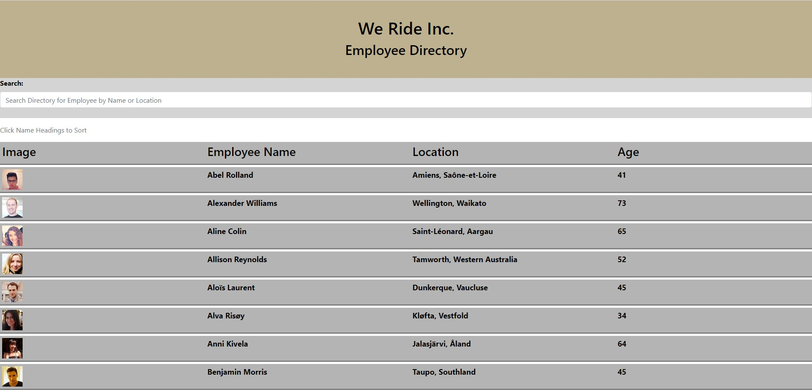

# Staff-Directory

## Description

Create an employee directory using Reat and Bootstrap providing the user the ability to search by emplyee name and provide the ability to sort by the user name.

## Installation
Run npm i for the package.json
## Usage

Run npm npm start in the terminal to open the page and get the api call

## References
Bootcamp activities 5, 18, 20, 23
Stackoverflow
W3 Schools

